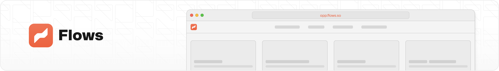

  

  
  
  

# Flows Cloud: the next generation tool for onboarding flows and product tours.

Flows are in the early stages of development. We are currently working on the first version of the product. The expected launch date is somewhere in **Q1 2024**. If you are interested in using Flows, please [sign up for the waitlist](https://flows.sh/).

- Create flows with a WYSIWYG editor or define them in your codebase
- With Flows Cloud you can create and update flows on the fly without having to redeploy your app
- Automatically track the performance of your flows
- Use advanced step types like wait, conditional, call a function, and AI decision
- Customize anything with CSS and JS

## Contributing

We ❤️ contributions big and small, more info in [CONTRIBUTING.md](/CONTRIBUTING.md) or see instruction on [developing Flows locally](/docs/development.md).

## Philosophy

Our mission is to make software easier to use and learn. To do that, we are building tools that help product teams create better onboarding flows and product tours.

The principles we use to build **Flows** are:

- **Speed:** Flows should be easy to create and deploy. There shouldn't be any dead time before an onboarding flow shows up to the user after a page loads.
- **Flexibility:** There shouldn't be any limits to what you can do with Flows. You should be able to create any experience you can imagine.
- **Reliability:** Flows should work every time. They should be robust and resilient to any changes in the underlying product.
- **Design:** Flows should have superior UX with beautiful UI. They should be a pleasure to create and a joy to experience.

## License

This repo is available under [CC BY-NC-ND 4.0](/LICENSE.md).

---

Created by [rbnd.studio](https://rbnd.studio/).
